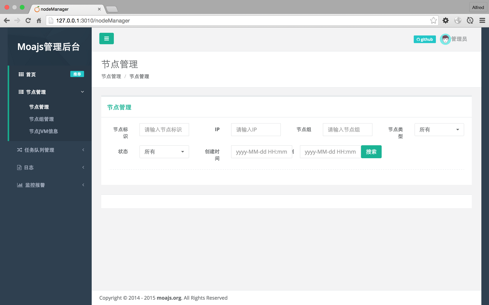

# Moa-Frontend

技术栈

- express
- jade
- bootstrap
- jquery


## 前后端分离实践

- 前端：[moa-frontend](https://github.com/moajs/moa-frontend)
  - public下面的采用nginx做反向代理
  - 其他的采用express+jade精简代码（ajax与后端交互）
- 后端：[moa-api](https://github.com/moajs/moa-api)

## Install

```
npm install 
npm start
```

访问 http://127.0.0.1:3010/

## Features

- 经典的 jQuery + bootstrap 简单易用
- 响应式，兼容移动端和pc端
- expressjs + jade 代码极简，功能强大
- 自动挂载路由
- 支持log4js日志

## Contributing

1. Fork it
2. Create your feature branch (`git checkout -b my-new-feature`)
3. Commit your changes (`git commit -am 'Add some feature'`)
4. Push to the branch (`git push origin my-new-feature`)
5. Create new Pull Request

## 版本历史

- v0.1.0 初始化版本

## 欢迎fork和反馈

- write by `i5ting` shiren1118@126.com

如有建议或意见，请在issue提问或邮件

## License

this repo is released under the [MIT
License](http://www.opensource.org/licenses/MIT).
